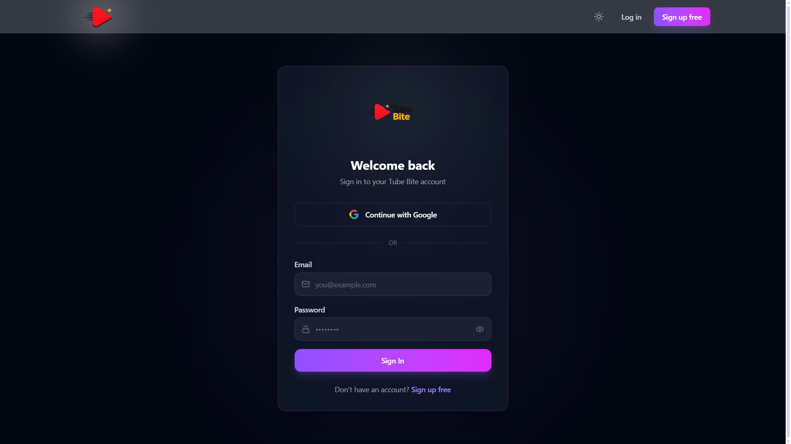
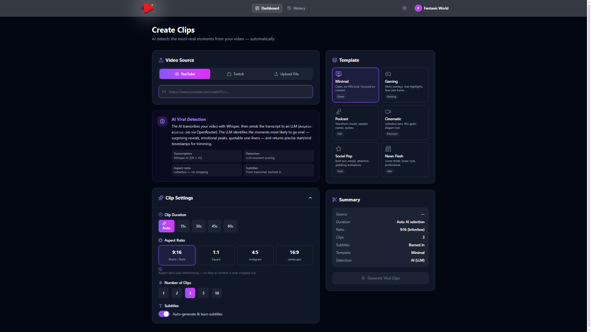
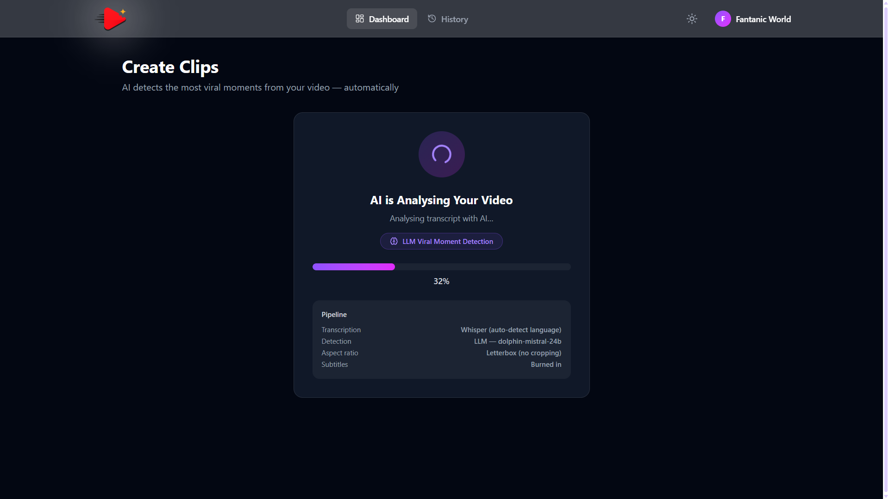
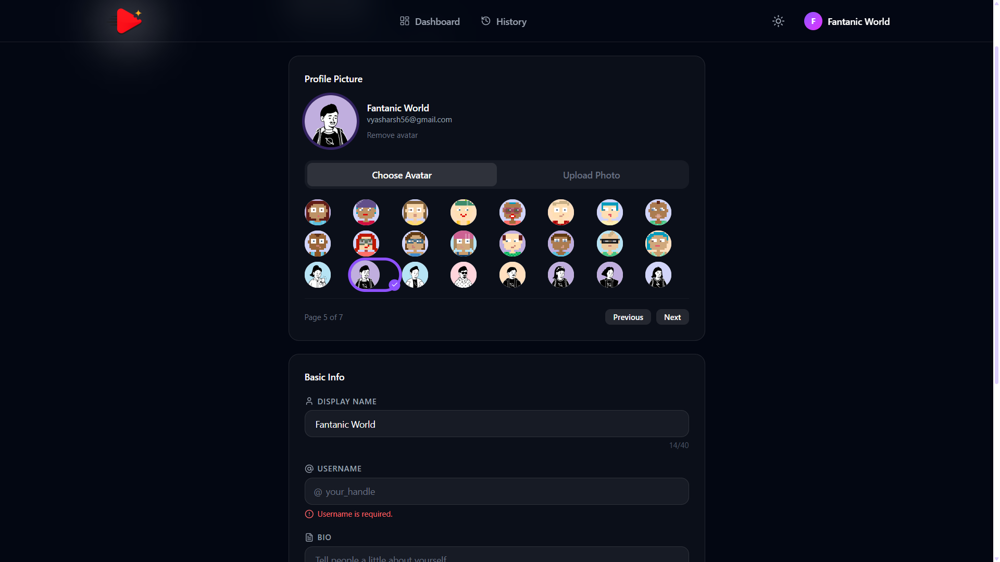

# Tube Bite

Tube Bite is an AI-powered platform for generating clips from videos.

## 🚀 Tech Stack

- **Frontend**: React 19, Vite, Tailwind CSS 4, TypeScript, Firebase
- **Backend**: Python FastAPI, MongoDB, Cloudinary, Firebase Auth

## 🛠️ Getting Started

### Frontend
```bash
npm install
npm run dev
```

### Backend
```bash
cd backend
pip install -r requirements.txt
uvicorn main:app --reload --port 8000
```

## ✨ Key Features
- **Clip Generation**: AI-driven video clipping.
- **Auth**: Secure authentication using Firebase.
- **History**: Keep track of all generated clips.
- **Templates**: Custom templates for different styles.

---

## Screenshots
Below are screenshots of the Tube Bite Web-app










